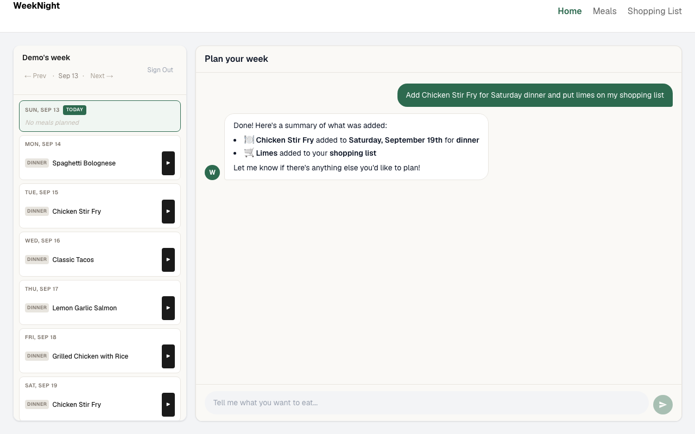
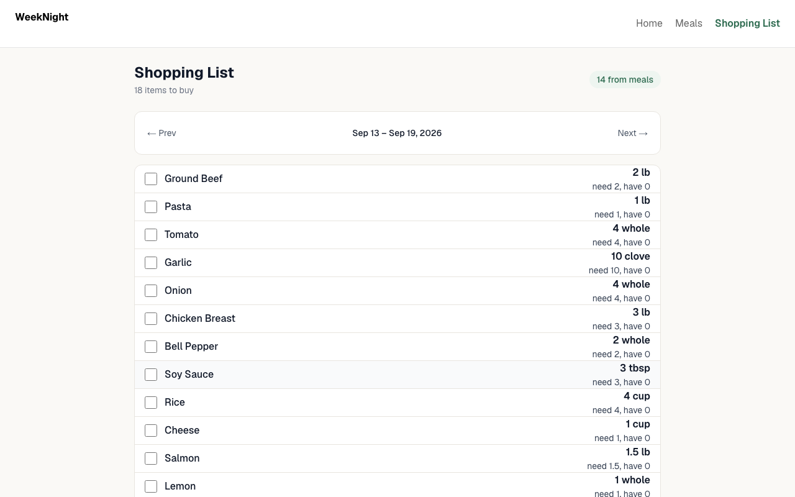

# WeekNight

AI meal planning assistant. Tell it what you want to eat this week in plain English. It finds the right meals in your library (or creates them), puts them on your calendar, and builds your shopping list.

**Live app:** https://aifood-sandy.vercel.app

## Demo access

Skip sign-up and use the shared demo account:

| | |
|---|---|
| **Email** | `demo@example.com` |
| **Password** | `WeekNightDemo2026` |

The demo account has a meal library, planned dinners, and a populated shopping list. It's shared, so other visitors may have changed things.

## Screenshots

| Chat and weekly planner | Shopping list |
|---|---|
|  |  |

## What it does

- **Chat-driven planning.** Ask for "tacos on Tuesday" or "three quick dinners this week." A Claude agent with tool access adds meals to the plan, removes them, creates new meals with ingredients when your library doesn't have what you asked for, and adds extra items to the shopping list.
- **Semantic meal matching.** Requests are matched against your meal library in two steps. Fuse.js fuzzy matching handles typos and near-exact names. If that misses, OpenAI embeddings and pgvector cosine similarity handle vague requests like "something spicy with chicken."
- **Shopping list built from the plan.** Ingredients from every planned meal in the week are combined into one list, along with any extra items the assistant added.
- **Cooking mode.** Step-by-step instructions for any planned meal.
- **Conversation summaries.** When chat history gets past a token budget, older turns are summarized by a second Claude call and saved, so the next session starts with that summary instead of the full transcript.

## Stack

| Layer | Technology |
|---|---|
| App | Next.js 16 (App Router), React 19, TypeScript, Tailwind CSS 4 |
| Database | PostgreSQL with pgvector on Supabase, Prisma ORM |
| AI agent | Claude API (`@anthropic-ai/sdk`) with tool use |
| Semantic search | OpenAI `text-embedding-3-small`, pgvector |
| Auth | Auth.js (NextAuth v5), Google OAuth and email/password with bcrypt |
| Hosting | Vercel |

## How the agent works

`/api/chat` sends the conversation to Claude with four tools: `add-meal-to-plan`, `create-meal`, `remove-meal-from-plan`, and `add-item-shopping-list`. Each tool call is run by forwarding the user's session to the matching `/api/tools/*` route, so every write goes through the same auth and per-user scoping as the rest of the app. Tool results go back to Claude until it has a final reply.

New meals get an embedding when they're created. It's stored in a `vector` column on the `meals` table and used for the semantic fallback when fuzzy matching doesn't find a good match.

## Running locally

You'll need Node 20+, Docker, an Anthropic API key, and an OpenAI API key.

```bash
git clone https://github.com/ermerga/WeekNight.git
cd WeekNight
npm install

# Postgres with pgvector
docker compose up -d

# Environment. Defaults point at the local Docker database.
cp .env.example .env
# then fill in AUTH_SECRET, ANTHROPIC_API_KEY, OPENAI_API_KEY

npx prisma migrate dev
npx prisma db seed    # preset meals and embeddings
npm run dev
```

Open http://localhost:3000 and create an account. Google sign-in is optional. Email/password works without it.

## Project structure

```
app/
  api/chat/          Claude agent loop and tool dispatch
  api/tools/         Tool implementations (plan, meals, shopping list, inventory)
  api/auth/          Auth.js handlers and registration
  cook/              Step-by-step cooking mode
  meals/             Meal library
  shopping-list/     Weekly shopping list
components/          Chat, planner, meals, and shopping list UI
lib/
  auth.ts            Auth.js config
  embeddings.ts      OpenAI embedding helper
prisma/
  schema.prisma      Data model
  seed.ts            Preset meals
```
